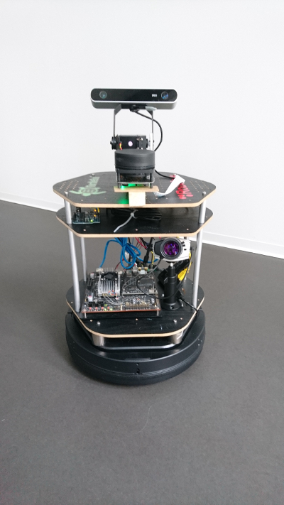
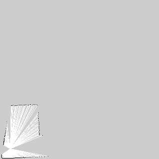

# IANA_IP6

The bachelor thesis developt by metataro and benikm91 during the spring of 2017.

It is an autonomous roboter that can:
* Map the enviroment
  - Explore randomly
  - Explore smartly
* Navigate (with the map) the enviroment
  - Uses the ROS navigation component
* Greet people it drives by
  - Face recognition with DLib, OpenCV and OpenFace (python implementation of Facenet)
* Recognise Room numbers while driving by

More Information: [Thesis](read_me_data/Thesis_v1.pdf)

| The robot | Example how the map develops while exploring |
|:---:|:---:|
|  |  |
